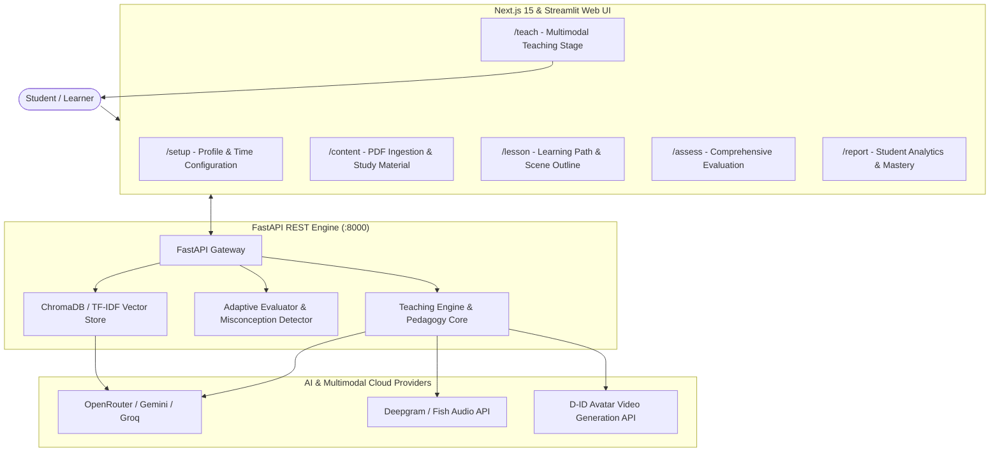

# 🎓 TUTIVRA — Multimodal Autonomous AI Teacher Platform

<p align="center">
  
  
  
  
  
  
  
</p>

> **TUTIVRA** is a next-generation, human-like AI Teacher platform that moves beyond static videos and generic chatbots. It autonomously guides students through structured, personalized, and interactive learning journeys—synthesizing real-time talking-head avatar videos, natural voice narration in multiple languages, dynamic subject-specific visuals, and closed-loop adaptive pedagogical branching.

---

## 🌟 Primary Capabilities

### 1. 🔄 The Complete Autonomous Teaching Loop
Tutivra implements a closed-loop human-like pedagogy:
```text
Understand  ➜  Plan  ➜  Explain  ➜  Demonstrate  ➜  Question  ➜  Evaluate  ➜  Adapt  ➜  Continue
```
- **Understand**: Analyzes the student's profile, past misconceptions, mastery score, and target learning goal.
- **Plan**: Synthesizes a structured scene-by-scene curriculum calibrated to the student's **available study time** (e.g. 5-min review vs. 30-min mastery).
- **Explain**: Delivers crystal-clear conceptual narrations with natural vocal intonation.
- **Demonstrate**: Generates synchronized, subject-aware visuals on the virtual blackboard.
- **Question**: Formulates contextual Socratic questions to probe understanding.
- **Evaluate**: Dissects student responses using AI reasoning to pinpoint exact misconceptions.
- **Adapt**: Dynamically branches—offering intuitive analogies and alternative visual proofs if the student is confused, or accelerating ahead if mastered.
- **Continue**: Progresses seamlessly through the adaptive curriculum.

---

### 2. 👤 Human-Like AI Avatar & Voice Synthesis
- **D-ID Talking-Head Video**: Generates full video lectures featuring human-like presenters with accurate lip-synchronization and natural facial expressions.
- **Ultra-Natural Voice (Deepgram / Fish Audio)**: Crystal-clear vocal delivery with proper cadence, emphasis, and pronunciation.
- **Multilingual Support**: Real-time instruction in **English**, **Hindi (हिंदी)**, and extensible to regional Indian and global languages.

---

### 3. 🎨 Subject-Aware Dynamic Visual Explanations
Rather than static images, Tutivra generates interactive and responsive visuals tailored to the subject domain:
- **Mathematics**: Step-by-step LaTeX formula derivations and geometric visual representations.
- **Computer Science**: Code sandboxes with syntax highlighting, algorithm execution flows, and ASCII architecture diagrams.
- **Science (Physics, Chemistry, Biology)**: Interactive process animations, molecular structures, and cyclical system diagrams.
- **Humanities & Business**: Comparative matrix tables, timelines, key takeaway cards, and mindmaps.

---

### 4. 🧠 Deep Misconception Diagnosis & Adaptive Re-Explanation
- **Non-Binary Evaluation**: Analyzes student answers for partial credit, depth of reasoning, and specific conceptual traps.
- **Instant Remediation (`/answer/reexplain`)**: When a misconception is detected, Tutivra does not simply repeat itself—it generates a fresh analogy, changes the explanation modality, and verifies comprehension with a follow-up diagnostic check.

---

### 5. 📚 Multi-Source RAG (Retrieval-Augmented Generation)
- Ingests student textbooks, PDFs, lecture notes, and syllabus outlines.
- Chunks and stores semantic embeddings in a vector knowledge base.
- Grounds curriculum, questions, and explanations strictly in validated curriculum standards.

---

### 6. 📊 Student Learning Analytics & Mastery Dashboard
- Real-time tracking of subject mastery index, attempt accuracy, and cognitive retention.
- Detailed diagnostic breakdown of resolved vs. lingering misconceptions.
- Actionable next-step recommendations and downloadable learning summaries.

---

## 🏛️ System Architecture



---

## 📁 Repository Structure

```text
TUTIVRA/
├── app/
│   ├── ai/
│   │   ├── teaching_engine.py    # Autonomous curriculum planning & scene generation
│   │   ├── adaptive_evaluator.py # Diagnostic answer evaluation & misconception analysis
│   │   ├── llm_client.py         # Multi-provider LLM abstraction (OpenRouter, Gemini, Groq)
│   │   ├── prompt_templates.py   # Subject-specific pedagogical prompt templates
│   │   └── student_model.py      # Bayesian-inspired mastery tracking & learning profiles
│   ├── api/
│   │   └── main.py               # FastAPI application with complete REST endpoints
│   ├── rag/
│   │   ├── document_loader.py    # PDF & document parser
│   │   ├── text_splitter.py      # Pedagogical semantic chunking
│   │   └── retriever.py          # Vector retrieval knowledge engine
│   ├── video/
│   │   ├── avatar_provider.py    # D-ID talking avatar video integration
│   │   ├── tts_provider.py       # Deepgram & Fish Audio high-fidelity TTS
│   │   ├── visual_generator.py   # Subject-aware HTML/SVG/LaTeX visual canvas generator
│   │   └── pipeline.py           # Full multimodal lesson-to-video assembler
│   └── database/
│       └── db.py                 # SQLite student state & persistent session store
├── ui/
│   ├── web/                      # Production Next.js 15 Web Application
│   │   ├── app/
│   │   │   ├── setup/page.tsx    # Learning goal & time constraint setup
│   │   │   ├── content/page.tsx  # Document upload & RAG management
│   │   │   ├── lesson/page.tsx   # Visual learning roadmap
│   │   │   ├── teach/page.tsx    # Avatar video, audio player, visual canvas & Q&A
│   │   │   ├── assess/page.tsx   # Post-lesson assessment quiz
│   │   │   └── report/page.tsx   # Comprehensive mastery & analytics report
│   │   ├── lib/                  # API client & localStorage state synchronizer
│   │   └── package.json
│   └── dashboard_v2.py           # Streamlit alternative desktop UI
├── tests/
│   ├── test_did_pipeline.py      # D-ID video & audio pipeline verification
│   └── test_api_e2e.py           # End-to-end API test suite
├── requirements.txt              # Python backend dependencies
└── README.md                     # Project documentation
```

---

## 🚀 Quick Start Guide

### Prerequisites
- **Python 3.10+** installed
- **Node.js 18+** and **npm** installed
- API Keys for:
  - **OpenRouter / Gemini** (LLM generation)
  - **Deepgram** or **Fish Audio** (Voice synthesis)
  - **D-ID** (AI Avatar video generation)

---

### Step 1: Clone the Repository
```bash
git clone https://github.com/shawsristi13/TUTIVRA.git
cd TUTIVRA
```

---

### Step 2: Configure Environment Variables
Create a `.env` file in the root `TUTIVRA` directory:

```env
# AI Model Configuration
OPENROUTER_API_KEY=your_openrouter_api_key
OPENROUTER_MODEL=google/gemini-3.5-flash

# Voice Synthesis (Deepgram / Fish Audio)
DEEPGRAM_API_KEY=your_deepgram_api_key
FISH_AUDIO_API_KEY=your_fish_audio_key_optional

# D-ID Avatar Video
DID_API_KEY=your_did_api_key
DID_PRESENTER_ID=amy-Aq6OmGZnMt

# Backend Server Configuration
API_PORT=8000
RAG_STORAGE_DIR=rag_storage
RAG_UPLOADS_DIR=rag_uploads
TUTIVRA_DB_PATH=tutivra.db
```

---

### Step 3: Start the Backend (FastAPI)
```bash
# Install Python dependencies
pip install -r requirements.txt

# Launch FastAPI server
python -m uvicorn app.api.main:app --host 0.0.0.0 --port 8000 --reload
```
The backend will be live at:
- **API Base**: `http://localhost:8000`
- **Interactive Swagger Docs**: `http://localhost:8000/docs`

---

### Step 4: Start the Frontend (Next.js)
```bash
# Navigate to the Next.js directory
cd ui/web

# Install npm dependencies
npm install

# Run the dev server
npm run dev
```
Open [**http://localhost:3000**](http://localhost:3000) in your browser.

---

## 📡 API Reference Overview

| Endpoint | Method | Description |
|---|---|---|
| `/health` | `GET` | System health check and provider readiness status |
| `/lesson/create` | `POST` | Generate an adaptive, time-bounded lesson curriculum |
| `/video/tts` | `POST` | Synthesize high-fidelity voice narration audio |
| `/video/avatar` | `POST` | Generate lip-synced talking avatar MP4 video |
| `/video/visual` | `POST` | Generate subject-aware HTML/LaTeX/SVG visual canvas |
| `/video/pipeline` | `POST` | Run full end-to-end multimodal video pipeline |
| `/question/generate`| `POST` | Generate Socratic questions calibrated to student level |
| `/answer/adaptive` | `POST` | Evaluate student answer, detect misconceptions & update mastery |
| `/answer/reexplain`| `POST` | Generate targeted alternative explanation for misconceptions |
| `/assessment/generate` | `POST` | Generate final comprehensive quiz |
| `/rag/upload` | `POST` | Ingest and vectorize textbook or PDF study material |
| `/student/{id}/report` | `GET` | Retrieve persistent student mastery analytics & learning profile |

---

## 💡 The TUTIVRA User Journey

1. **Onboarding (`/setup`)**: The student enters their name, selects their learning level (Beginner, Intermediate, Advanced), chooses their language (English, Hindi), defines their topic, and sets their available study time.
2. **Curriculum Review (`/lesson`)**: Tutivra displays an interactive roadmap of core concepts and learning scenes.
3. **Interactive Teaching (`/teach`)**:
   - The D-ID AI Avatar introduces and explains the concept with synchronized audio.
   - The virtual visual blackboard displays real-time formulas, interactive diagrams, and highlighted steps.
   - Socratic check-ins pause the lesson to ask targeted diagnostic questions.
   - If the student answers with a misconception, Tutivra immediately triggers an alternative analogy and visual clarification before moving ahead.
4. **Final Assessment (`/assess`)**: The student takes an adaptive evaluation to validate complete conceptual mastery.
5. **Mastery Analytics (`/report`)**: The student inspects their radar chart, cognitive mastery index, resolved misconceptions, and next recommendations.

---

## 🛡️ License & Acknowledgments

Built for the **Innovation Hackathon**.  
Powered by **FastAPI**, **Next.js**, **OpenRouter**, **Deepgram**, and **D-ID**.
